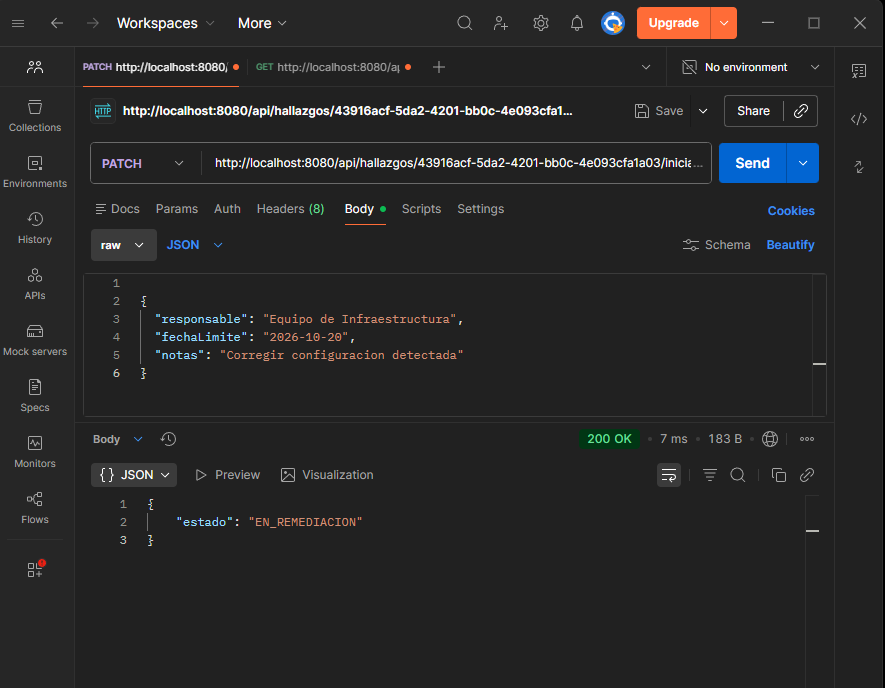
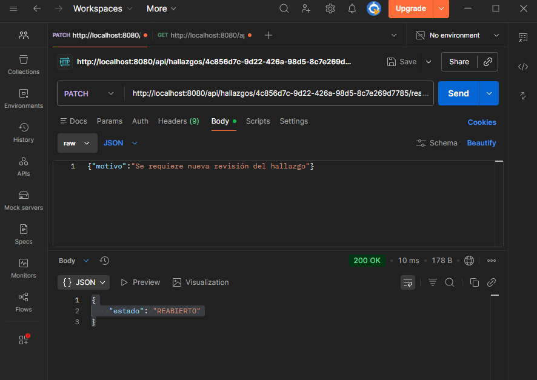
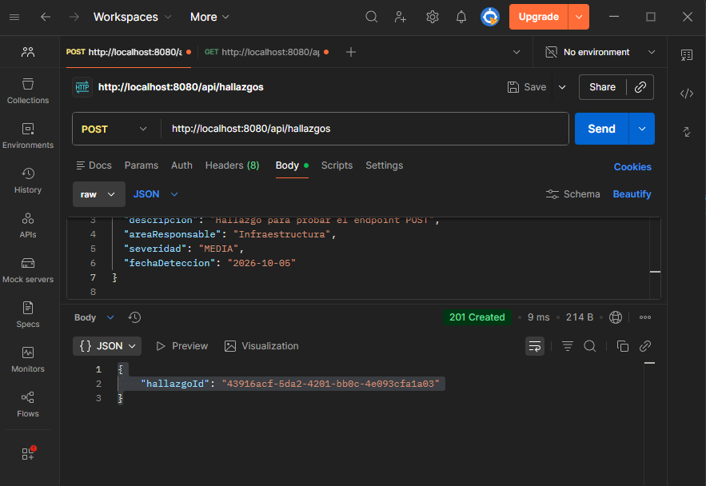
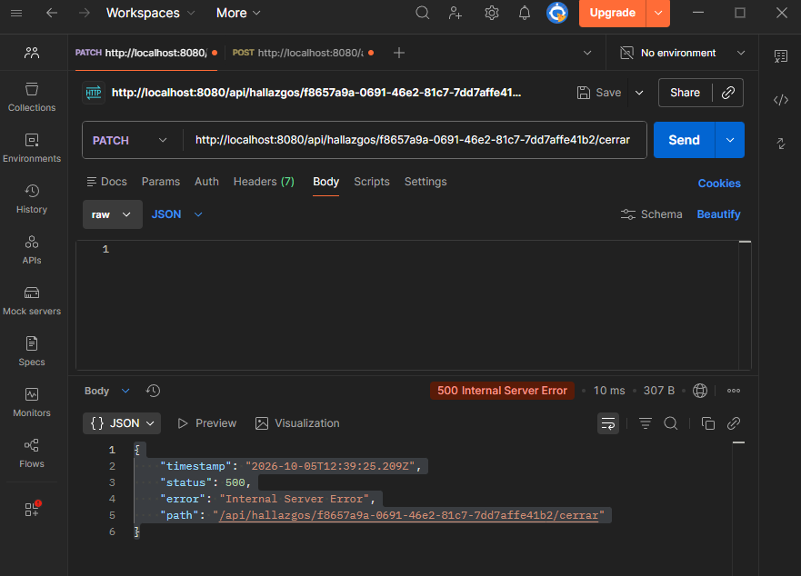
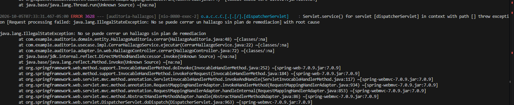

# Post-contenido — Unidad 8: Patrones Arquitectónicos II

## Descripción
Repositorio del post-contenido de la Unidad 8 de Patrones de Diseño
de Software — Sexto Semestre. Sistema de seguimiento de hallazgos
de auditoria interna implementado con Clean Architecture (Parte 1)
y extendido con dashboard agregado y bitacora de trazabilidad
(Parte 2), sobre el mismo proyecto Spring Boot.

## Parte 1 — Clean Architecture (Hallazgos de Auditoria)
El proyecto organiza los cuatro circulos concentricos: Entities
(domain/, con el Aggregate Root HallazgoAuditoria y su maquina de
estados EstadoHallazgo), Use Cases (usecase/, con los puertos y sus
implementaciones), Interface Adapters (adapter/, con
HallazgoController y HallazgoRepositoryAdapter) y Frameworks &
Drivers (Spring Boot + JPA). La dependencia del codigo siempre
apunta hacia adentro, hacia domain/.

## Parte 2 — Analisis costo-beneficio de CQRS/Event Sourcing
Para la extensión del sistema se decidió no implementar CQRS ni Event Sourcing completos. En su lugar, se mantendrá el repositorio y el modelo de estado actuales, agregando consultas específicas para el dashboard y una bitácora de auditoría para registrar las transiciones de los hallazgos.

La decisión se basa en los siguientes criterios:

Escala y carga: el sistema corresponde a un laboratorio académico y será desarrollado por una sola persona. No existen usuarios concurrentes reales ni una carga de lectura y escritura que justifique separar la infraestructura de comandos y consultas.
Complejidad de las consultas: el dashboard requiere principalmente conteos y promedios sobre los hallazgos. Estas consultas pueden resolverse mediante consultas agregadas, por ejemplo con GROUP BY, sobre el mismo esquema de persistencia. No se necesita una base de datos ni un modelo de lectura independiente.
Consistencia: el dashboard no requiere actualización en tiempo real. Es suficiente que los datos reflejen el estado persistido al momento de realizar la consulta, como ocurre con un reporte bajo demanda. Por ello, no existe una necesidad clara de mantener proyecciones eventualmente consistentes separadas del modelo principal.
Naturaleza de la trazabilidad: el requisito de cumplimiento consiste en conservar una bitácora cronológica de los cambios de estado del hallazgo. No se necesita reconstruir el estado actual reproduciendo todos los eventos históricos mediante replay. Por tanto, una bitácora de auditoría adicional resulta suficiente y evita convertir el modelo completo en un sistema basado en Event Sourcing.
Complejidad y experiencia del equipo: el proyecto es desarrollado por una sola persona y no existe un experto de negocio dedicado al modelado de eventos. Mantener simultáneamente un modelo de comandos, un modelo de consultas y un almacén de eventos introduciría complejidad adicional que no está respaldada por las necesidades actuales del sistema.

Por estas razones, se rechaza CQRS completo y Event Sourcing completo para esta versión. La alternativa seleccionada consiste en extender la solución actual con proyecciones de lectura puntuales para el dashboard y una bitácora de auditoría persistida junto al estado actual del hallazgo. Esta solución satisface los requisitos planteados sin introducir infraestructura ni modelos separados cuya complejidad no estaría justificada por la escala del laboratorio.

## Decisiones de diseño
1. Severidad como enum simple vs. EstadoHallazgo como enum con
   maquina de estados — Ambos se modelan con un nivel distinto de comportamiento justamente porque ambos difieren en su comportamiento, ambos estan sometidos a restricciones distintas impuestas por la logica de dominio. Mantener Severidad como un Enum simple evita agregar complejidad sin una necesidad del dominio.

2. PlanRemediacion como Value Object embebido vs. agregado separado
   — PlanRemediacion se modela como un Value Object embebido dentro de HallazgoAuditoria porque su existencia está ligada al hallazgo y no necesita una identidad ni un ciclo de vida independiente. Además, un hallazgo no puede pasar a EN_REMEDIACION sin un plan válido ni puede cerrarse sin que exista uno previamente definido. Al mantener el plan dentro del agregado como una unidad atómica de consistencia, HallazgoAuditoria puede controlar estas operaciones y garantizar que el estado y el plan se mantengan consistentes dentro de la misma unidad transaccional.

    Separarlo como un agregado independiente implicaría coordinar ambos agregados y sus repositorios, aumentando la complejidad y creando posibles ventanas de inconsistencia.

3. CQRS/Event Sourcing completos vs. extension liviana del
   repositorio existente — Se decidió no implementar CQRS ni Event Sourcing completos. En su lugar, se extendió el repositorio existente con consultas puntuales para el dashboard y una bitácora de auditoría para registrar los cambios de estado.

Esta decisión se justifica porque el laboratorio tiene un único desarrollador, no presenta usuarios concurrentes reales y no requiere actualmente múltiples modelos de lectura ni reconstruir el estado mediante eventos. Implementar CQRS y Event Sourcing completos agregaría complejidad sin un beneficio proporcional.

Esta decisión sigue la estrategia incremental de la sección 7.3, que recomienda añadir complejidad arquitectónica solo cuando el costo de no tenerla lo justifique. Si posteriormente aparecen necesidades de auditoría más avanzada, múltiples modelos de lectura o reconstrucción histórica del estado, se podría evaluar CQRS y Event Sourcing.

4. Bitacora simple (HistorialCambioEstado) vs. Event Store completo
   — Se decidió usar una bitácora de auditoría simple en lugar de Event Sourcing. HallazgoJpaEntity seguirá guardando el estado actual del hallazgo y una tabla HistorialCambioEstado registrará cada cambio de estado en la misma transacción.

Event Sourcing no es necesario porque Cumplimiento solo necesita consultar la secuencia de cambios. No se necesita reconstruir el estado mediante replay ni usar los eventos como fuente de verdad.

Además, según las señales de sobre-ingeniería de la Sección 7.2, el proyecto es desarrollado por una sola persona, no existe un experto de negocio para modelar eventos y no se requieren múltiples modelos de lectura ni una escala diferente entre lecturas y escrituras. Implementar un Event Store agregaría complejidad sin un beneficio necesario para este proyecto.

Por ello, se mantiene la solución actual y se agrega únicamente la bitácora necesaria. Si en el futuro aparecen requisitos que justifiquen reconstruir estados o generar múltiples proyecciones, se podría evaluar una evolución hacia CQRS y Event Sourcing.

## Cómo ejecutar
```
$ mvn spring-boot:run
```

## Herramientas utilizadas
- Java 17, Spring Boot 4.1.1, Spring Data JPA, H2
- Apache Maven, Postman/curl, Git, GitHub

### Documentacion

#### ScreenShots parte 1







## Conclusiones
El desarrollo de ambas partes permitió comprender cómo una arquitectura puede evolucionar desde una organización en capas hacia una arquitectura más orientada al dominio, manteniendo separadas las reglas de negocio, los casos de uso y los detalles de infraestructura. La implementación de Clean Architecture, junto con el modelo de dominio y la bitácora de auditoría, mostró que es posible incorporar necesidades de trazabilidad sin introducir desde el inicio la complejidad de CQRS y Event Sourcing. La decisión de mantener una solución ligera resulta adecuada para el tamaño y las necesidades actuales del sistema, pero debería reconsiderarse si aparecieran múltiples modelos de lectura, mayores necesidades de auditoría o reconstrucción histórica del estado a partir de eventos. Asimismo, un crecimiento significativo de usuarios, concurrencia o requisitos de escalabilidad podría justificar la adopción progresiva de CQRS y, posteriormente, Event Sourcing si sus beneficios superaran la complejidad adicional
